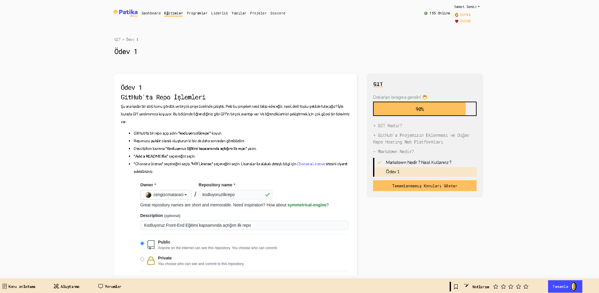

# Kodluyoruz Ilk Repo

Bu repo [Kodluyoruz](https://app.patika.dev/courses/git) Front-End Eğitiminde ilk repo. içreisinde bir adet README dosyası bir adet de index.html barındırıyor.

## Installation

Öncelikle projeyi clonelayın. (Buraya sizin reponuzdan aldığınız

```git
  git clone https://github.com/sametdmr/kodluyoruzilkrepo.git
```

## Usage

Projeyi cloneladıktan sonra Visual Studio Code programında açınız.

Linux için:

```bash
  cd kodluyoruzilkrepo
  code .
```

## Contrubuting

Pull requestler kabul edilir. Büyük değişikler için, lütfen önce neyi değiştirmek istediğinizi tartışmak için bir konu açınız.

## License

[MIT](LICENSE)

---


